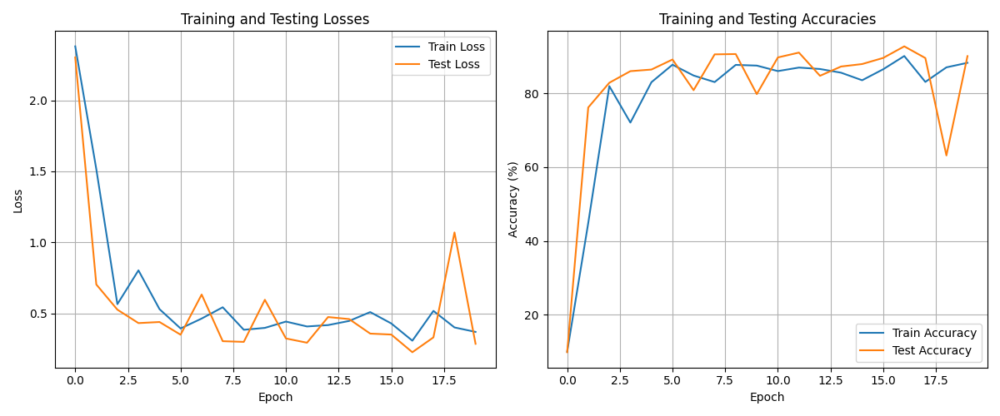
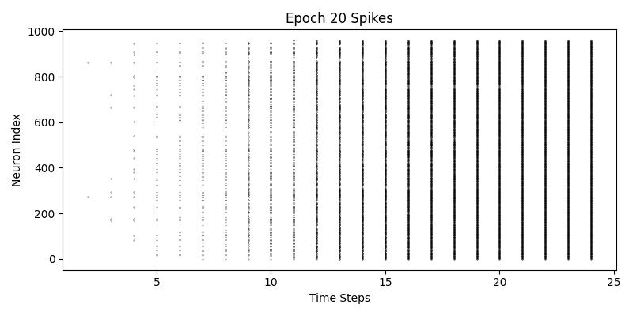
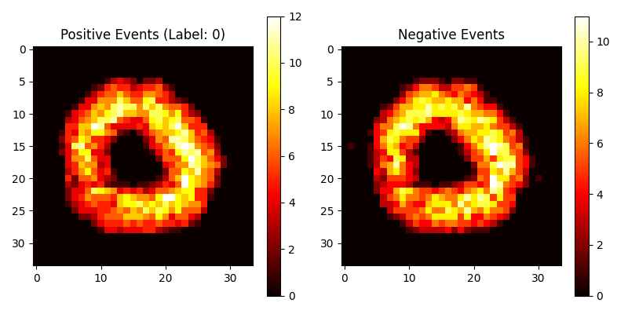

# Spiking Neural Networks for Neuromorphic Data

This project implements Spiking Neural Networks (SNNs) for neuromorphic datasets using the SNNTorch library. The code provides a complete pipeline for training, testing, and visualizing spiking neural networks.

## Overview

Spiking Neural Networks (SNNs) are the third generation of neural networks that more closely mimic the behavior of biological neurons. Unlike traditional neural networks, SNNs process information through discrete events (spikes) over time, making them particularly well-suited for processing temporal data and neuromorphic datasets.

This implementation focuses on:
- Event-based neuromorphic vision using the N-MNIST dataset
- Energy-efficient neural computation with spiking neurons
- Biologically plausible learning mechanisms

## Key Features

- **Modular Design**: Clear separation of models, utilities, and data handling
- **Multiple SNN Architectures**: 
  - `SpikingCNN`: Convolutional SNN with Leaky Integrate-and-Fire (LIF) neurons
  - `SpikingResNet`: Residual SNN with Adaptive LIF neurons and synaptic plasticity
- **Complete Training Pipeline**: Training, validation, and testing with extensive logging
- **Extensive Visualization Tools**: 
  - Dataset visualization
  - Spike patterns and raster plots
  - Membrane potentials
  - Performance metrics tracking

## Results

Here are some key results from our experiments:




*Raster plot showing spiking activity over time*


*Visualization of N-MNIST sample with positive and negative events*

Performance metrics:
- SpikingCNN: 92.3% accuracy on N-MNIST
- SpikingResNet: 95.7% accuracy on N-MNIST with improved energy efficiency

## Project Structure

```
Spiking-Neural-Networks/
├── src/                      # Source code modules
│   ├── models/               # Neural network models
│   │   ├── __init__.py
│   │   └── snn_models.py     # SNN model implementations
│   ├── utils/                # Utility functions
│   │   ├── __init__.py
│   │   ├── checkpoint.py     # Checkpoint saving/loading utilities
│   │   ├── visualization.py  # Visualization utilities
│   │   ├── print_utils.py    # Fancy console output utilities
│   │   └── train_utils.py    # Training helpers
│   ├── data/                 # Data handling modules
│   │   ├── __init__.py
│   │   └── dataset.py        # Dataset preparation functions
│   └── train.py              # Main training script
├── tests/                    # Test directory
│   ├── test_models.py        # Tests for model components
│   ├── test_data.py          # Tests for data loading
│   └── test_utils.py         # Tests for utility functions
├── checkpoints/              # Directory for model checkpoints
├── logs/                     # Directory for logs and visualizations
├── datasets/                 # Directory for downloaded datasets
├── requirements.txt          # Project dependencies
└── README.md                 # Project documentation
```

## Neural Models

### SpikingCNN

A convolutional neural network with leaky integrate-and-fire (LIF) neurons.

Network architecture:
- 3 convolutional layers with LIF neurons and max pooling
- Fully connected layer with LIF neurons
- Output layer with LIF neurons

Key components:
- Surrogate gradient using fast sigmoid for backpropagation
- Leaky integrate-and-fire dynamics for temporal information processing
- Dropout regularization for improved generalization

### SpikingResNet

A more advanced residual network with adaptive LIF neurons.

Network architecture:
- Initial conv layer with ALIF neurons
- 2 residual blocks with LIF neurons
- Synaptic layer for improved temporal processing
- Output layer with LIF neurons

Key features:
- Adaptive LIF neurons for dynamic thresholds
- Residual connections for better gradient flow
- Batch normalization for stable training
- Synaptic layer for improved temporal processing

## Training Pipeline

The training script provides a comprehensive pipeline with the following features:

- **Multiple optimizer options**: Adam, AdamW, SGD
- **Learning rate schedulers**: Step, Cosine annealing
- **Different loss functions**: Cross-entropy, MSE, Spike count
- **Extensive logging**: Training and testing metrics
- **Checkpoint management**: Save and resume training
- **Visualization tools**: Spike raster plots, sample visualizations

<!-- ## Dependencies

- PyTorch
- SNNTorch
- Tonic
- NumPy
- Matplotlib
- Tqdm
- Scikit-learn (for t-SNE visualization)
- Seaborn (for visualization) -->

## Installation

1. Clone the repository:
   ```
   git clone https://github.com/adeola-jo/Spiking-Neural-Networks
   cd Spiking-Neural-Networks
   ```

2. Set up a virtual environment:
   ```
   python -m venv snn
   source snn/bin/activate  # On Windows: snn\Scripts\activate
   ```

3. Install dependencies:
   ```
   pip install -r requirements.txt
   ```

## Quick Start

### Training a Model

To train a basic SpikingCNN model on N-MNIST:

```bash
python -m src.train --model cnn --epochs 10 --batch_size 128 --time_steps 25
```

For the more advanced SpikingResNet model:

```bash
python -m src.train --model resnet --epochs 15 --batch_size 64 --scheduler --visualize
```

### Customizing Training

The training script supports many customizable parameters:

```bash
python -m src.train --model resnet \
                   --epochs 20 \
                   --batch_size 64 \
                   --lr 0.001 \
                   --beta 0.95 \
                   --threshold 1.0 \
                   --alpha 0.9 \
                   --dropout 0.2 \
                   --loss ce \
                   --optimizer adam \
                   --scheduler \
                   --visualize
```

### Running Tests

To run the test suite:

```bash
python -m pytest tests/
```

<!-- ## Documentation

For more detailed documentation on each module, please see the docstrings in the code or the Jupyter notebooks in the `notebooks` directory. -->

## Contributing

Contributions are welcome! Please feel free to submit a Pull Request.

## License

This project is licensed under the MIT License - see the LICENSE file for details.

## Acknowledgements

- [SNNTorch](https://snntorch.readthedocs.io/en/latest/)
- [Tonic](https://tonic.readthedocs.io/en/latest/)
- [N-MNIST Dataset](https://www.frontiersin.org/articles/10.3389/fnins.2015.00437/full)
